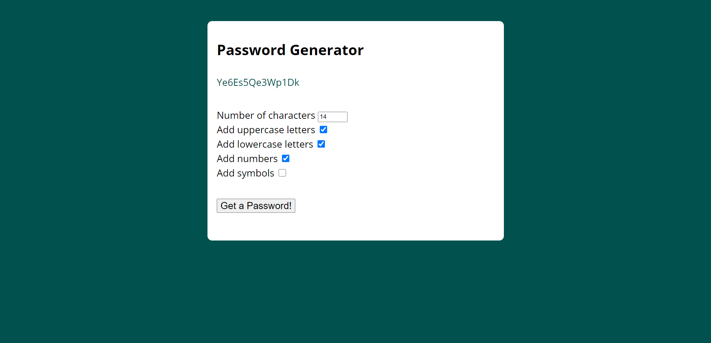

<h1 align="center">
    Password Generator
</h1>

<h1>

</h1>

<h1>

</h1>

# 🔥 About 📝📋

Project that I developed in January 2020 to help people find a strong and effective password quickly. I used Babel as a compiler so that people with older browsers can access the password generator as well.

---

# 💻 Features 

This project was developed with:
- [HTML](https://developer.mozilla.org/en-US/docs/Web/HTML)
- [CSS](https://developer.mozilla.org/en-US/docs/Web/CSS)
- [JavaScript](https://developer.mozilla.org/en-US/docs/Learn/Getting_started_with_the_web/JavaScript_basics)
- [WebPack](https://webpack.js.org/)
- [Babel](https://babeljs.io/)

---

# 📂 Getting started
```bash

# Clone this repository using
$ git clone https://github.com/jpautran/passwordGenerator

# Move yourself to the directory
$ cd file/path

# Install the dependencies
$ npm install

```
---

<h3 align="center">
Created by João Paulo Autran 🚀
</h3>            